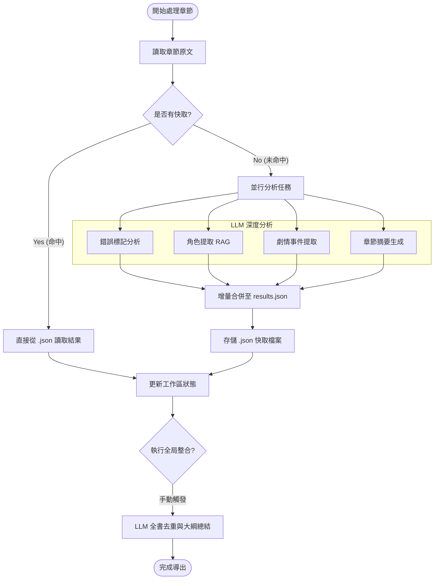

## ✅ AI 輔助小說校對系統 — 完成

位置：`novel/proofreader/`

### 📁 建立的檔案

| 檔案 | 功能 |
|------|------|
| `start.bat` | 一鍵啟動（vLLM + 後端 + 瀏覽器） |
| `backend/config.py` | 全域設定：vLLM URL、Model名、RAG配置 |
| `backend/llm_client.py` | vLLM OpenAI-compatible 非同步客戶端 |
| `backend/rag.py` | Chroma 向量庫 + 任務感知檢索策略 |
| `backend/prompts.py` | 五種繁中 LLM prompt（標記/角色/事件/時間線/人名） |
| `backend/tasks.py` | 核心邏輯：LLM呼叫、倒序修改、快取、Audit Log |
| `backend/main.py` | FastAPI 伺服器（port 7788），所有 API 端點 |
| `frontend/index.html` | 主介面：五 Tab 全功能 UI |
| `frontend/style.css` | 暗色玻璃擬態設計，琥珀色 accent |
| `frontend/app.js` | Human-in-the-loop 完整互動邏輯 |

### 🚀 啟動方式

1. **先啟動 vLLM**（port 8000）：執行 `start.bat` 或手動執行
2. **後端**（port 7788）：`C:\Users\user\venv\Scripts\python.exe main.py`
3. **瀏覽器**：`http://localhost:7788`

### 🔑 核心設計要點

- **LLM 只標記，不修改**：所有文本變更由使用者決定（Accept/Ignore/Manual）。
- **倒序套用**：修改採逆序處理，完全避免內容變動導致的 index 位移。
- **RAG 任務感知**：標記錯誤時參考角色庫，劇情分析時參考前文段落與事件。
- **多層級快取**：
    - **文字雜湊快取**：相同文本不重複呼叫 LLM。
    - **全局結果重用**：若 `results.json` 已有分析結果，批次掃描時會優先重用以節省資源。
- **人名字典累積**：使用者確認的人名修正自動寫入字典供後續使用。
- **智能合併**：全局角色整合時，若無新資訊會自動跳過 LLM，節省 Token。

---
---

# 📘 AI 輔助校對系統 — 操作指南 (2026 版)

這是一套設計給「人類與 AI 協作」的小說品質提升工具。以下是完整操作流程。

## 🚀 第一步：啟動系統
1.  執行資料夾中的 `start.bat`。
2.  系統會自動開啟瀏覽器頁面 `http://localhost:7788`。
3.  **初次載入**：vLLM 模型載入約需 30 秒，看到 API 狀態顯示「連線正常」即可開始。

---

## 🧠 分析任務與邏輯說明

系統目前提供四種核心分析任務，均具備「快取優先」與「RAG 強化」特性：

| 任務 | 核心邏輯過程 | 備註 |
| :--- | :--- | :--- |
| **錯誤註記** | 1. 檢查 `.applied` 檔 (已套用則跳過) 2. 執行本地正則檢查 (的地得/雜訊) 3. RAG 檢索已知角色名防止誤報 4. LLM 標記錯誤與建議 5. 偏移修正定位原文 | 標記後需手動確認 |
| **角色提取** | 1. 讀取 `results.json` 現有角色作為 RAG 參考 2. LLM 識別本章新角色與特徵 3. **全局整合**：對比現有清單，若無新資訊則跳過 LLM 整合 | 跨章節去重 |
| **事件提取** | 1. 優先檢查快取與 `results.json` 是否已有本章事件 2. RAG 檢索前文事件確保銜接 3. LLM 提取事件名、描述、涉及角色與重要性 | 自動併入時間軸 |
| **章節摘要** | 1. 檢查快取與 `results.json` 是否已有摘要 2. 若章節過長自動切塊處理 3. LLM 生成劇情概述並存入全局摘要區塊 | 支援全書整合 |

---

## 📂 第二步：選擇小說章節 (單章校對)
1.  **左側側邊欄**：顯示你的本地檔案。
2.  **過濾規則**：系統只會顯示「資料夾」與「.txt 檔案」，不顯示 html 或雜檔。
3.  **單點擊**：點擊檔案名稱，中間工作區會載入文字內容。
4.  **專案名稱**：在左側輸入小說名稱（例如：`飛劍問道`），這會影響導出的檔名。

---

## 📝 第三步：人工校對與修正 (Human-in-the-loop)
1.  點擊上方按鈕 **「開始分析」**：AI 會標記錯字、人名一致性、雜訊與語意問題。
2.  **高亮標記**：原文中會出現帶顏色下劃線的文字，點擊它可以在右側快速定位。
3.  **右側問題卡片**：
    *   **接受**：AI 建議正確，選這個。
    *   **忽略**：AI 建議錯誤或不需要改，選這個。
    *   **手動**：你想自己輸入正確內容，點擊後會彈窗讓你輸入。
4.  **套用修改**：所有卡片處理完（或處理一部分）後，點擊上方大大的 **「套用修改」**，文字才會真正被替換。

---

## 📦 第四步：批次處理功能 (自動化工作流)

如果你有大量章節需要處理，建議使用批次功能預先生成分析數據：

1.  **選擇章節**：在左側「檔案列表」，點擊檔案旁的 `+` 按鈕加入隊列。
2.  **啟動任務**：切換至「批次處理」分頁，點擊 **「開始批次標記」**。
3.  **背景執行**：系統會並行處理錯誤標記、角色、事件與摘要。
4.  **即時快取**：所有結果會即時存入 `data/cache`，即便中途停止也不會遺失進度。

### 🛠️ AI 分析邏輯流程圖

---

## 👤 第五步：角色與劇情分析 (功能分頁)
校對完文字後，可以切換分頁進行結構化分析：

*   **角色分析**：點擊「執行角色分析」，AI 會整理出本章出現的角色姓名、身份、描述。
*   **劇情事件**：點擊「執行劇情抽取」，AI 會整理出本章發生的關鍵事件與涉及角色。
*   **時間線**：整合各章節事件，形成故事發展脈絡。
*   **產生故事大綱**：快速生成 300-500 字的本章/全書劇情摘要。

---

## 📖 第六步：導出至閱讀助手
1.  校對與分析完成後，點擊上方 **「導出助手」**。
2.  **結果去向**：這會把所有角色資料、劇情摘要、時間軸封裝成 JSON，存入 `assistant/data/專案名稱.json`。
3.  **效果**：當你使用 `assistant` 資料夾下的 HTML 閱讀小說時，滑鼠移到角色名稱上就會彈出剛才 AI 分析的精確資料，側邊欄也會出現劇情的 📚 圖示。

---

> [!NOTE]
> - 本系統不會自動修改你的原始 .txt 檔案（除非你點擊「匯出」下載）。
> - 所有行為都必須經過你的「接受」或「手動確認」，確保高品質輸出。